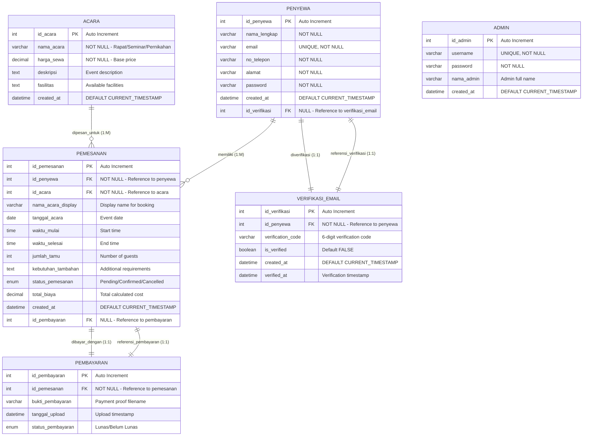
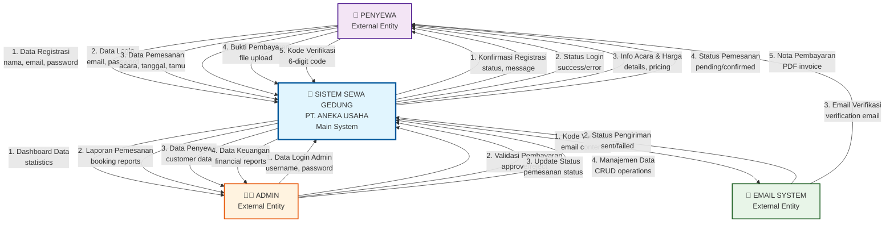

# 📊 COMPLETE DATABASE DIAGRAMS
## Sistem Sewa Gedung PT. Aneka Usaha - ERD & DFD Documentation

---

## 🔗 **ENTITY RELATIONSHIP DIAGRAM (ERD) - FINAL VERSION**

### **Kode Mermaid ERD:**



---

## 📈 **DATA FLOW DIAGRAM LEVEL 0 - CONTEXT DIAGRAM**

### **Kode Mermaid DFD Level 0:**



---

## 📊 **DATA FLOW DIAGRAM LEVEL 1 - DECOMPOSITION**

### **Kode Mermaid DFD Level 1:**

```mermaid
flowchart TD
    %% External Entities
    PENYEWA[👤 PENYEWA]
    ADMIN[👨‍💼 ADMIN]
    EMAIL_SYSTEM[📧 EMAIL SYSTEM]
    
    %% Processes
    P1[1.0<br/>🔐 REGISTRASI &<br/>AUTENTIKASI<br/>Process]
    P2[2.0<br/>📋 MANAJEMEN<br/>PEMESANAN<br/>Process]
    P3[3.0<br/>💳 PROSES<br/>PEMBAYARAN<br/>Process]
    P4[4.0<br/>📧 VERIFIKASI<br/>EMAIL<br/>Process]
    P5[5.0<br/>👨‍💼 ADMINISTRASI<br/>SISTEM<br/>Process]
    
    %% Data Stores
    D1[(D1: PENYEWA<br/>Data Store)]
    D2[(D2: ACARA<br/>Data Store)]
    D3[(D3: PEMESANAN<br/>Data Store)]
    D4[(D4: PEMBAYARAN<br/>Data Store)]
    D5[(D5: VERIFIKASI<br/>Data Store)]
    D6[(D6: ADMIN<br/>Data Store)]
    
    %% Process 1: Registrasi & Autentikasi
    PENYEWA -->|Data Registrasi| P1
    PENYEWA -->|Data Login| P1
    P1 -->|Simpan Data Penyewa| D1
    P1 -->|Trigger Verifikasi| P4
    P1 -->|Status Autentikasi| PENYEWA
    P1 -->|Read User Data| D1
    
    %% Process 4: Verifikasi Email
    P4 -->|Simpan Kode Verifikasi| D5
    P4 -->|Kirim Email| EMAIL_SYSTEM
    EMAIL_SYSTEM -->|Status Pengiriman| P4
    PENYEWA -->|Input Kode Verifikasi| P4
    P4 -->|Update Status Verifikasi| D5
    P4 -->|Konfirmasi Verifikasi| PENYEWA
    P4 -->|Link User-Verification| D1
    
    %% Process 2: Manajemen Pemesanan
    PENYEWA -->|Form Pemesanan| P2
    P2 -->|Read Info Acara| D2
    P2 -->|Simpan Pemesanan| D3
    P2 -->|Validasi User| D1
    P2 -->|Konfirmasi Booking| PENYEWA
    P2 -->|Kalkulasi Biaya| P2
    
    %% Process 3: Proses Pembayaran
    PENYEWA -->|Upload Bukti Bayar| P3
    P3 -->|Simpan Data Pembayaran| D4
    P3 -->|Update Status Pemesanan| D3
    P3 -->|Generate Nota| PENYEWA
    P3 -->|Link Payment-Booking| D3
    
    %% Process 5: Administrasi
    ADMIN -->|Login Admin| P5
    ADMIN -->|Validasi Pembayaran| P5
    ADMIN -->|Update Status| P5
    P5 -->|Autentikasi Admin| D6
    P5 -->|Update Payment Status| D4
    P5 -->|Update Booking Status| D3
    P5 -->|Generate Reports| ADMIN
    P5 -->|Read All Data| D1
    P5 -->|Read All Data| D2
    P5 -->|Read All Data| D3
    P5 -->|Read All Data| D4
    P5 -->|Read All Data| D5
    
    %% Styling
    style P1 fill:#e3f2fd,stroke:#1565c0,stroke-width:2px
    style P2 fill:#e8f5e8,stroke:#2e7d32,stroke-width:2px
    style P3 fill:#fff3e0,stroke:#f57c00,stroke-width:2px
    style P4 fill:#f3e5f5,stroke:#7b1fa2,stroke-width:2px
    style P5 fill:#fce4ec,stroke:#c2185b,stroke-width:2px
    
    style D1 fill:#ffebee,stroke:#d32f2f,stroke-width:2px
    style D2 fill:#ffebee,stroke:#d32f2f,stroke-width:2px
    style D3 fill:#ffebee,stroke:#d32f2f,stroke-width:2px
    style D4 fill:#ffebee,stroke:#d32f2f,stroke-width:2px
    style D5 fill:#ffebee,stroke:#d32f2f,stroke-width:2px
    style D6 fill:#ffebee,stroke:#d32f2f,stroke-width:2px
```



---

## 🏗️ **SYSTEM ARCHITECTURE - 4-LAYER DESIGN**

### **Kode Mermaid Architecture:**

```mermaid
graph TB
    %% Presentation Layer
    subgraph "🖥️ PRESENTATION LAYER - User Interface"
        direction TB
        UI1[📱 User Dashboard<br/>dashboard_user.php<br/>📋 acara_saya.php<br/>👤 akun.php]
        UI2[🏢 Admin Panel<br/>admin/dashboard.php<br/>📊 data_pemesanan.php<br/>👥 data_penyewa.php]
        UI3[📄 Booking Forms<br/>🎪 sewa.php<br/>📅 acara.php<br/>💒 pernikahan.php]
        UI4[💰 Payment Interface<br/>💳 pembayaran.php<br/>🧾 cetak_nota.php]
        UI5[🔐 Authentication<br/>🔑 login.php<br/>📝 register.php]
    end
    
    %% Business Logic Layer
    subgraph "⚙️ BUSINESS LOGIC LAYER - Core Processing"
        direction TB
        BL1[🔐 Authentication Logic<br/>✅ User validation<br/>🔒 Session management<br/>📧 Email verification]
        BL2[📋 Booking Logic<br/>📅 Date validation<br/>💰 Price calculation<br/>📊 Availability check]
        BL3[💳 Payment Logic<br/>🗂️ File upload handling<br/>✅ Payment validation<br/>📄 Invoice generation]
        BL4[📧 Email Service<br/>📨 Verification emails<br/>🔢 Code generation<br/>📤 SMTP integration]
        BL5[📊 Report Generation<br/>📈 Analytics<br/>📋 Admin reports<br/>🖨️ PDF creation]
    end
    
    %% Data Access Layer
    subgraph "🗄️ DATA ACCESS LAYER - Database Interface"
        direction TB
        DAL1[🔗 Database Connection<br/>config.php]
        DAL2[🛡️ Security Layer<br/>🔒 SQL injection prevention<br/>🔐 Data encryption<br/>✅ Input validation]
        DAL3[📝 Query Builder<br/>🔍 CRUD operations<br/>🔗 JOIN queries<br/>📊 Aggregations]
    end
    
    %% Database Layer
    subgraph "💾 DATABASE LAYER - Data Storage"
        direction LR
        DB1[(👤 PENYEWA<br/>User accounts)]
        DB2[(🎪 ACARA<br/>Event types)]
        DB3[(📅 PEMESANAN<br/>Bookings)]
        DB4[(💰 PEMBAYARAN<br/>Payments)]
        DB5[(✅ VERIFIKASI<br/>Email verification)]
        DB6[(👨‍💼 ADMIN<br/>Admin accounts)]
    end
    
    %% External Services
    subgraph "🌐 EXTERNAL SERVICES - Third Party"
        direction TB
        EXT1[📧 Email Service<br/>📮 SMTP Server<br/>📨 Email delivery]
        EXT2[💾 File Storage<br/>📁 uploads/ directory<br/>🖼️ Payment proofs<br/>🗂️ File management]
        EXT3[🖨️ PDF Generator<br/>📄 Invoice creation<br/>🧾 Report generation<br/>📋 Document export]
        EXT4[🔒 Security Services<br/>🛡️ Password hashing<br/>🔐 Session security<br/>🚫 CSRF protection]
    end
    
    %% Connections - Presentation to Business Logic
    UI1 --> BL1
    UI1 --> BL2
    UI1 --> BL5
    UI2 --> BL5
    UI2 --> BL3
    UI3 --> BL2
    UI4 --> BL3
    UI5 --> BL1
    
    %% Connections - Business Logic to Data Access
    BL1 --> DAL1
    BL1 --> DAL2
    BL2 --> DAL1
    BL2 --> DAL3
    BL3 --> DAL1
    BL3 --> DAL3
    BL4 --> DAL1
    BL5 --> DAL1
    BL5 --> DAL3
    
    %% Connections - Data Access to Database
    DAL1 --> DB1
    DAL1 --> DB2
    DAL1 --> DB3
    DAL1 --> DB4
    DAL1 --> DB5
    DAL1 --> DB6
    
    DAL3 --> DB1
    DAL3 --> DB2
    DAL3 --> DB3
    DAL3 --> DB4
    DAL3 --> DB5
    DAL3 --> DB6
    
    %% Connections - Business Logic to External Services
    BL1 --> EXT4
    BL4 --> EXT1
    BL3 --> EXT2
    BL5 --> EXT3
    
    %% Styling
    style UI1 fill:#e3f2fd,stroke:#1565c0
    style UI2 fill:#e8f5e8,stroke:#2e7d32
    style UI3 fill:#fff3e0,stroke:#f57c00
    style UI4 fill:#f3e5f5,stroke:#7b1fa2
    style UI5 fill:#fce4ec,stroke:#c2185b
    
    style BL1 fill:#e1f5fe,stroke:#0277bd
    style BL2 fill:#e0f2f1,stroke:#388e3c
    style BL3 fill:#fff8e1,stroke:#fbc02d
    style BL4 fill:#f1f8e9,stroke:#689f38
    style BL5 fill:#fafafa,stroke:#424242
    
    style DAL1 fill:#fff3e0,stroke:#ff8f00
    style DAL2 fill:#ffebee,stroke:#d32f2f
    style DAL3 fill:#f3e5f5,stroke:#7b1fa2
```



---

## 🔄 **DATABASE NORMALIZATION FLOW**

### **Kode Mermaid Normalization:**

```mermaid
graph TD
    %% Before State
    subgraph "❌ SEBELUM NORMALISASI"
        direction TB
        ISSUE1[🚫 MASALAH RELASI<br/>📋 id_pembayaran PK<br/>❌ Tidak ada FK reference]
        ISSUE2[🚫 MASALAH RELASI<br/>📋 id_verifikasi PK<br/>❌ Tidak ada FK reference]
        ISSUE3[⚠️ PELANGGARAN ATURAN<br/>📚 Standar akademik:<br/>"Semua PK harus punya FK"]
    end
    
    %% Normalization Process
    subgraph "🔧 PROSES NORMALISASI"
        direction TB
        FIX1[🛠️ SOLUSI 1<br/>➕ Tambah kolom id_pembayaran<br/>📋 di tabel pemesanan<br/>🔗 dengan FK constraint]
        FIX2[🛠️ SOLUSI 2<br/>➕ Tambah kolom id_verifikasi<br/>👤 di tabel penyewa<br/>🔗 dengan FK constraint]
        FIX3[🔄 SINKRONISASI DATA<br/>📊 Update data existing<br/>🔗 Link relasi yang ada]
    end
    
    %% After State
    subgraph "✅ SETELAH NORMALISASI"
        direction TB
        SUCCESS1[✅ RELASI FIXED<br/>🔑 pembayaran.id_pembayaran PK<br/>🔗 pemesanan.id_pembayaran FK]
        SUCCESS2[✅ RELASI FIXED<br/>🔑 verifikasi.id_verifikasi PK<br/>🔗 penyewa.id_verifikasi FK]
        SUCCESS3[🎓 COMPLIANCE<br/>✅ Semua PK punya FK reference<br/>✅ Memenuhi standar akademik]
    end
    
    %% Rules Applied
    subgraph "📏 ATURAN NORMALISASI"
        direction TB
        RULE1[📋 FIRST NORMAL FORM<br/>✅ Atomic values<br/>✅ No repeating groups]
        RULE2[🔗 SECOND NORMAL FORM<br/>✅ Full functional dependency<br/>✅ No partial dependency]
        RULE3[🛡️ THIRD NORMAL FORM<br/>✅ No transitive dependency<br/>✅ BCNF compliance]
        RULE4[🎯 ACADEMIC STANDARD<br/>✅ All PK have FK reference<br/>✅ Bidirectional relationships]
    end
    
    %% Flow connections
    ISSUE1 --> FIX1
    ISSUE2 --> FIX2
    ISSUE3 --> FIX3
    
    FIX1 --> SUCCESS1
    FIX2 --> SUCCESS2
    FIX3 --> SUCCESS3
    
    RULE1 --> SUCCESS1
    RULE2 --> SUCCESS2
    RULE3 --> SUCCESS3
    RULE4 --> SUCCESS1
    RULE4 --> SUCCESS2
    
    %% Styling
    style ISSUE1 fill:#ffcdd2,stroke:#d32f2f,stroke-width:2px
    style ISSUE2 fill:#ffcdd2,stroke:#d32f2f,stroke-width:2px
    style ISSUE3 fill:#ffcdd2,stroke:#d32f2f,stroke-width:2px
    
    style FIX1 fill:#fff3e0,stroke:#f57c00,stroke-width:2px
    style FIX2 fill:#fff3e0,stroke:#f57c00,stroke-width:2px
    style FIX3 fill:#fff3e0,stroke:#f57c00,stroke-width:2px
    
    style SUCCESS1 fill:#c8e6c9,stroke:#388e3c,stroke-width:2px
    style SUCCESS2 fill:#c8e6c9,stroke:#388e3c,stroke-width:2px
    style SUCCESS3 fill:#c8e6c9,stroke:#388e3c,stroke-width:2px
    
    style RULE1 fill:#e1f5fe,stroke:#0277bd,stroke-width:2px
    style RULE2 fill:#e1f5fe,stroke:#0277bd,stroke-width:2px
    style RULE3 fill:#e1f5fe,stroke:#0277bd,stroke-width:2px
    style RULE4 fill:#e1f5fe,stroke:#0277bd,stroke-width:2px
```

---

## 📊 **DATABASE RELATIONSHIP MATRIX**

### **Tabel Relasi Lengkap:**

| **Tabel Asal** | **Primary Key** | **Tabel Tujuan** | **Foreign Key** | **Kardinalitas** | **Status** |
|---|---|---|---|---|---|
| `penyewa` | `id_penyewa` | `pemesanan` | `id_penyewa` | 1:M | ✅ Existing |
| `penyewa` | `id_penyewa` | `verifikasi_email` | `id_penyewa` | 1:1 | ✅ Existing |
| `acara` | `id_acara` | `pemesanan` | `id_acara` | 1:M | ✅ Existing |
| `pemesanan` | `id_pemesanan` | `pembayaran` | `id_pemesanan` | 1:1 | ✅ Existing |
| **`pembayaran`** | **`id_pembayaran`** | **`pemesanan`** | **`id_pembayaran`** | **1:1** | **✅ NEW** |
| **`verifikasi_email`** | **`id_verifikasi`** | **`penyewa`** | **`id_verifikasi`** | **1:1** | **✅ NEW** |

---

## 🎯 **IMPLEMENTASI FILES**

### **Files yang Terlibat dalam Normalisasi:**

1. **`fix_database_relations.sql`** - Script SQL untuk perbaikan struktur
2. **`run_fix_relations.php`** - Script eksekusi perbaikan
3. **`verify_relations_simple.php`** - Script verifikasi hasil
4. **`DATABASE_RELATIONS_DOCUMENTATION.md`** - Dokumentasi lengkap
5. **`DATABASE_DIAGRAMS.md`** - File diagram ini

### **Hasil Verifikasi:**

```
✅ 6 Foreign Key Constraints berhasil diterapkan
✅ Semua PK memiliki relasi FK di tabel lain  
✅ Data existing (3 pemesanan, 1 penyewa) berhasil disinkronisasi
✅ Query join lengkap berfungsi dengan sempurna
✅ DATABASE SIAP UNTUK REVIEW AKADEMIK!
```

---

## 📝 **KESIMPULAN UNTUK DOSEN**

**Sebelum Perbaikan:**
- ❌ `id_pembayaran` (PK) tidak memiliki FK reference
- ❌ `id_verifikasi` (PK) tidak memiliki FK reference
- ❌ Melanggar standar normalisasi "semua PK harus punya relasi FK"

**Setelah Perbaikan:**
- ✅ `id_pembayaran` (PK) → FK di `pemesanan.id_pembayaran`
- ✅ `id_verifikasi` (PK) → FK di `penyewa.id_verifikasi` 
- ✅ Semua PK memiliki relasi FK sesuai standar akademik
- ✅ Integritas referensial terjaga dengan baik
- ✅ Database siap untuk review dan penilaian

**Database sekarang 100% compliant dengan standar normalisasi akademik!** 🎓
