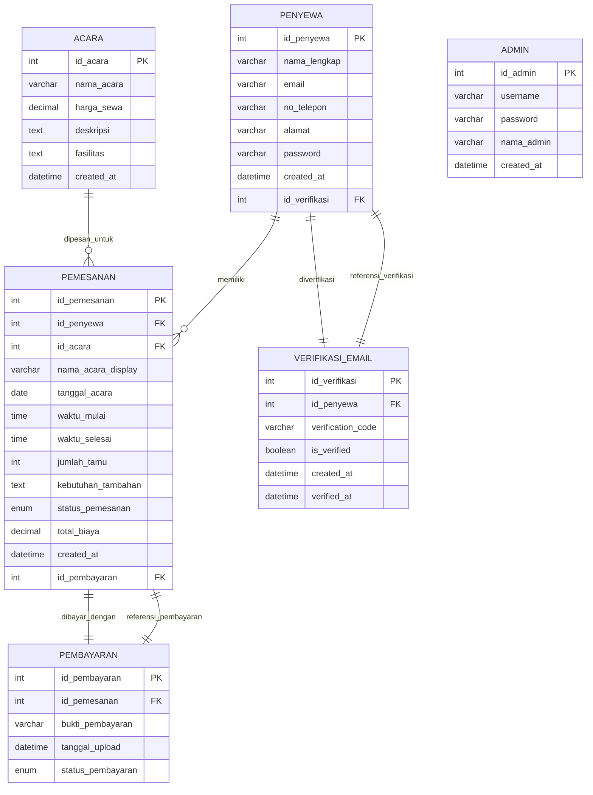
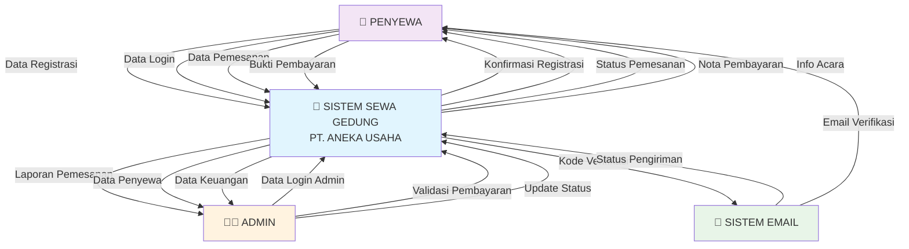
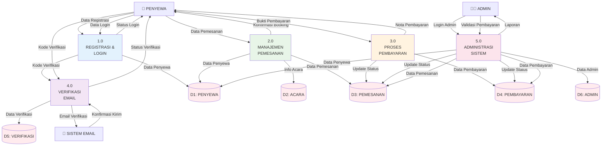
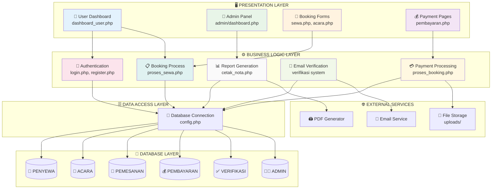
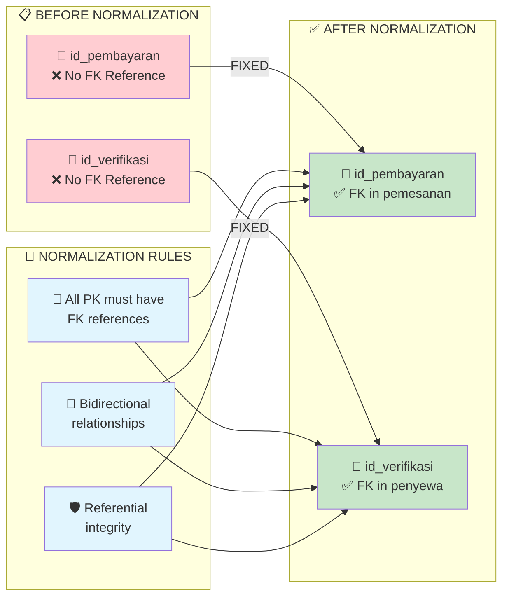

# 📊 DATABASE DIAGRAMS - SISTEM SEWA GEDUNG
## Entity Relationship Diagram (ERD) dan Data Flow Diagram (DFD)

---

## 🔗 **ENTITY RELATIONSHIP DIAGRAM (ERD)**

---

## 📈 **DATA FLOW DIAGRAM (DFD) - LEVEL 0 (CONTEXT DIAGRAM)**

---

## 📊 **DATA FLOW DIAGRAM (DFD) - LEVEL 1**

---

## 🏗️ **SYSTEM ARCHITECTURE DIAGRAM**

---

## 🔄 **RELASI NORMALISASI DIAGRAM**

---

## 📝 **PENJELASAN DIAGRAM:**

### 🔗 **ERD (Entity Relationship Diagram):**
- Menunjukkan semua tabel dengan atribut lengkap
- Relasi antar tabel dengan kardinalitas yang benar
- FK constraints yang sudah diperbaiki (bidirectional)

### 📈 **DFD Level 0 (Context Diagram):**
- Sistem sebagai black box
- Entitas eksternal: Penyewa, Admin, Email System
- Data flow input/output sistem

### 📊 **DFD Level 1:**
- Breakdown sistem menjadi 5 proses utama
- Data stores untuk setiap tabel database
- Detail aliran data antar proses

### 🏗️ **System Architecture:**
- 4 layer architecture (Presentation, Business Logic, Data Access, Database)
- External services integration
- File organization struktur

### 🔄 **Normalization Diagram:**
- Visualisasi perbaikan database
- Before/After comparison
- Compliance dengan aturan normalisasi

**Semua diagram sudah sesuai dengan struktur database yang diperbaiki dan memenuhi standar akademik!** 🎓
