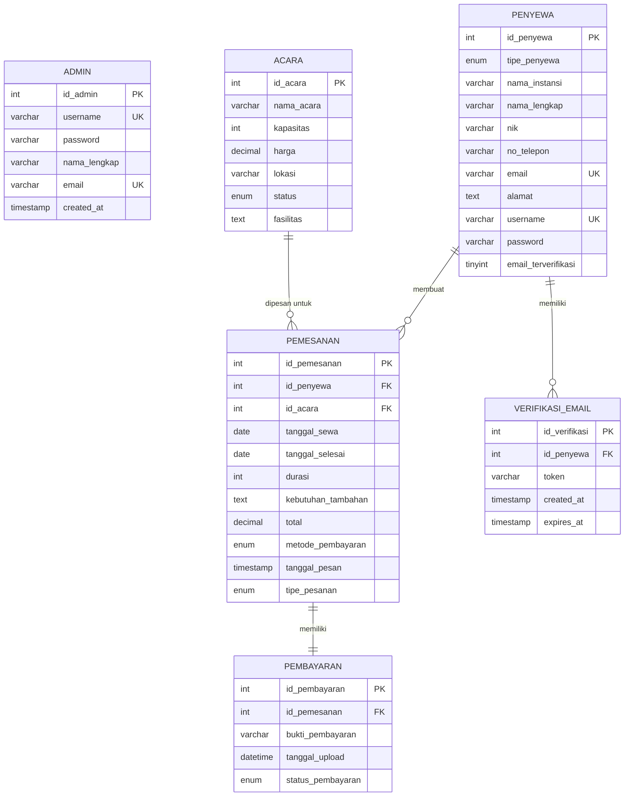
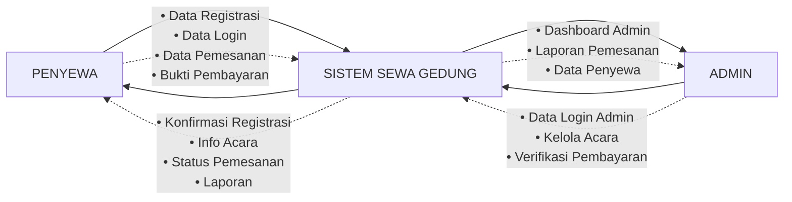
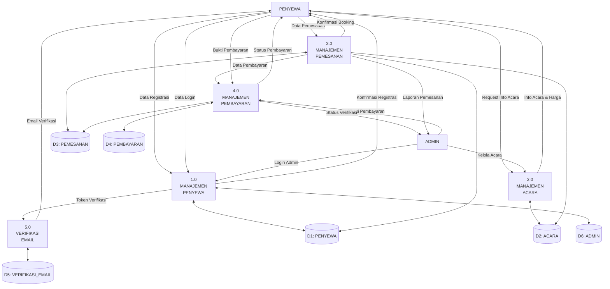
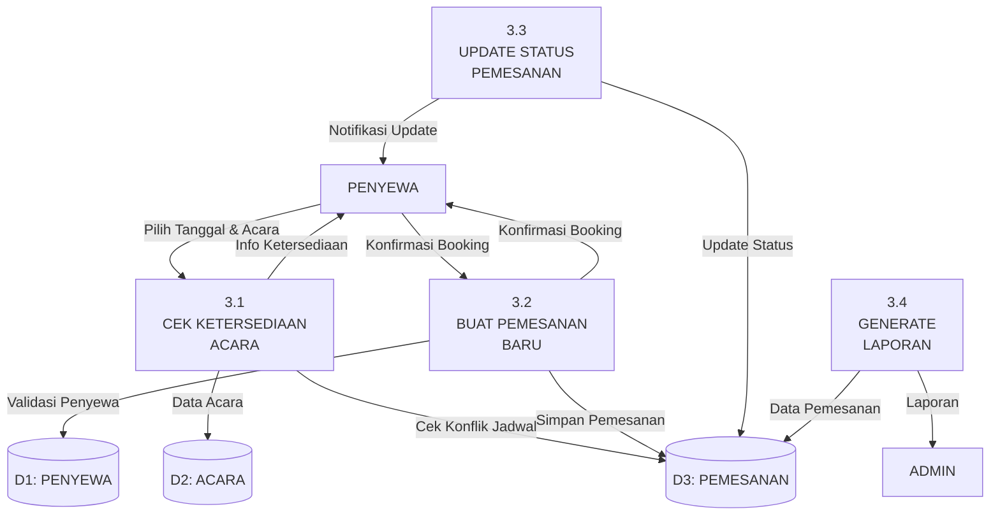

# ERD DAN DFD SISTEM SEWA GEDUNG PT ANEKA

## ENTITY RELATIONSHIP DIAGRAM (ERD)



## STRUKTUR RELASI DATABASE

### 1. **ADMIN**
- **Primary Key**: id_admin
- **Unique Keys**: username, email
- **Fungsi**: Mengelola sistem sewa gedung

### 2. **PENYEWA** 
- **Primary Key**: id_penyewa
- **Unique Keys**: email, username
- **Types**: individu, instansi
- **Fungsi**: Customer yang menyewa gedung

### 3. **ACARA**
- **Primary Key**: id_acara
- **Fungsi**: Jenis acara/gedung yang bisa disewa
- **Status**: tersedia, tidak tersedia

### 4. **PEMESANAN**
- **Primary Key**: id_pemesanan
- **Foreign Keys**: 
  - id_penyewa → PENYEWA(id_penyewa)
  - id_acara → ACARA(id_acara)
- **Fungsi**: Transaksi pemesanan gedung

### 5. **PEMBAYARAN**
- **Primary Key**: id_pembayaran
- **Foreign Key**: id_pemesanan → PEMESANAN(id_pemesanan)
- **Fungsi**: Data pembayaran dan bukti transfer

### 6. **VERIFIKASI_EMAIL**
- **Primary Key**: id_verifikasi
- **Foreign Key**: id_penyewa → PENYEWA(id_penyewa)
- **Fungsi**: Token verifikasi email penyewa

## KARDINALITAS RELASI

| Relasi | Kardinalitas | Deskripsi |
|--------|--------------|-----------|
| PENYEWA - PEMESANAN | 1:N | Satu penyewa dapat membuat banyak pemesanan |
| ACARA - PEMESANAN | 1:N | Satu acara dapat dipesan berkali-kali |
| PEMESANAN - PEMBAYARAN | 1:1 | Setiap pemesanan memiliki satu pembayaran |
| PENYEWA - VERIFIKASI_EMAIL | 1:N | Satu penyewa dapat memiliki banyak token verifikasi |

---

## DATA FLOW DIAGRAM (DFD)

### DFD LEVEL 0 (CONTEXT DIAGRAM)



### DFD LEVEL 1 (DECOMPOSITION)



### DFD LEVEL 2 - PROSES MANAJEMEN PEMESANAN (3.0)



---

## ALUR PROSES UTAMA

### 1. **REGISTRASI PENYEWA**
```
Penyewa → Input Data → Validasi → Simpan ke DB → Generate Token → Kirim Email Verifikasi
```

### 2. **PEMESANAN GEDUNG**
```
Penyewa Login → Pilih Acara → Pilih Tanggal → Cek Ketersediaan → Konfirmasi → Buat Pemesanan → Generate Payment
```

### 3. **PEMBAYARAN**
```
Upload Bukti → Validasi Admin → Update Status → Notifikasi Penyewa
```

### 4. **MANAJEMEN ADMIN**
```
Login Admin → Dashboard → Kelola Acara → Verifikasi Pembayaran → Generate Laporan
```

---

## TEKNOLOGI YANG DIGUNAKAN

| Komponen | Teknologi |
|----------|-----------|
| **Frontend** | HTML5, CSS3, JavaScript, Bootstrap |
| **Backend** | PHP 8.x |
| **Database** | MySQL/MariaDB |
| **Authentication** | Session-based with bcrypt |
| **File Upload** | PHP File Handling |
| **Email** | PHP Mailer (untuk verifikasi) |

---

## KEAMANAN DATABASE

### 1. **Foreign Key Constraints**
- ON DELETE CASCADE
- ON UPDATE CASCADE

### 2. **Data Validation**
- ENUM untuk status terbatas
- NOT NULL untuk field wajib
- UNIQUE untuk email dan username

### 3. **Password Security**
- Hashing dengan bcrypt
- Salt otomatis

### 4. **Email Verification**
- Token-based verification
- Expiration time untuk token
