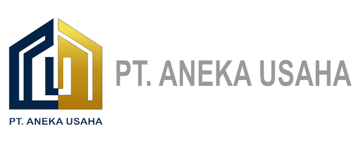
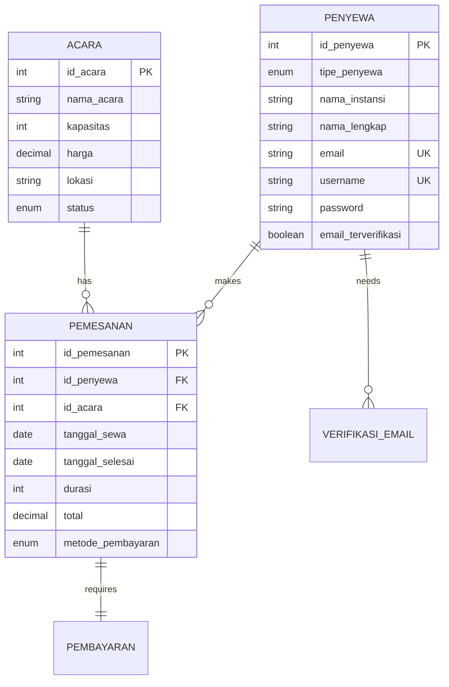

# 🏢 Sistem Sewa Gedung PT Aneka

<div align="center">



[](https://php.net/)
[](https://mysql.com/)
[](https://getbootstrap.com/)
[](LICENSE)
[]()

**🎯 Sistem manajemen pemesanan gedung/ruangan modern dengan interface yang responsif dan user-friendly**

[Demo](#-demo) • [Fitur](#-fitur-utama) • [Instalasi](#-instalasi) • [Dokumentasi](#-dokumentasi) • [Kontribusi](#-kontribusi)

</div>

---

## 📋 Deskripsi

Sistem Sewa Gedung PT Aneka adalah aplikasi web yang memungkinkan individu dan instansi untuk memesan gedung atau ruangan untuk berbagai keperluan acara seperti seminar, rapat, dan pernikahan. Sistem ini dilengkapi dengan fitur pembayaran online, verifikasi email, dan dashboard admin yang komprehensif.

## ✨ Fitur Utama

### 👥 **Untuk Penyewa**
- 🔐 **Registrasi & Login** - Sistem autentikasi yang aman untuk individu dan instansi
- 📅 **Booking System** - Pemesanan gedung dengan kalender interaktif
- 💰 **Kalkulasi Otomatis** - Perhitungan harga real-time berdasarkan durasi
- 💳 **Multiple Payment** - Mendukung QRIS, Transfer Bank (BCA, BNI, BRI, Mandiri)
- 📧 **Email Verification** - Verifikasi akun melalui email
- 📱 **Responsive Design** - Interface yang optimal di semua device

### 👨‍💼 **Untuk Admin**
- 📊 **Dashboard Analytics** - Monitoring pemesanan dan revenue
- ✅ **Payment Verification** - Verifikasi bukti pembayaran
- 🏢 **Event Management** - Kelola jenis acara dan pricing
- 👤 **User Management** - Manajemen data penyewa
- 📈 **Reporting System** - Laporan comprehensive

### 🔧 **Fitur Teknis**
- 🛡️ **Security First** - Password hashing, SQL injection prevention, XSS protection
- 🎨 **Modern UI/UX** - Design gradient dengan Inter font dan FontAwesome icons
- 📱 **Mobile Optimized** - Fully responsive untuk semua screen size
- ⚡ **Performance** - Optimized database queries dan caching
- 📝 **Comprehensive Logging** - Activity tracking dan error logging

## 🛠️ Tech Stack

<div align="center">

| Frontend | Backend | Database | Tools |
|----------|---------|----------|-------|
|  |  |  |  |
|  |  |  |  |
|  |  | |  |
|  | | | |

</div>

## 🚀 Instalasi

### Prerequisites
```bash
PHP 8.0+
MySQL 5.7+ atau MariaDB 10.3+
Apache 2.4+ dengan mod_rewrite
Web server (XAMPP/WAMP/LAMP recommended)
```

### Quick Start

1. **Clone repository**
   ```bash
   git clone https://github.com/yourusername/sewa-gedung.git
   cd sewa-gedung
   ```

2. **Setup Database**
   ```sql
   CREATE DATABASE gedung_pt_aneka;
   mysql -u root -p gedung_pt_aneka < gedung_pt_aneka_complete.sql
   ```

3. **Configure Database**
   ```php
   // config.php
   $host = 'localhost';
   $dbname = 'gedung_pt_aneka';
   $username = 'root';
   $password = 'your_password';
   ```

4. **Set Permissions**
   ```bash
   chmod 755 uploads/
   chmod 644 config.php
   ```

5. **Access Application**
   ```
   http://localhost/sewa-gedung
   ```

### Default Admin Access
```
Username: admin
Password: admin123
```

## 📸 Screenshots

<div align="center">

### 🏠 Homepage


### 🔐 Login Interface


### 📊 Admin Dashboard


### 💳 Payment Process
.png)

</div>

## 🏗️ Arsitektur Sistem

```
┌─────────────────┐    ┌─────────────────┐    ┌─────────────────┐
│   Frontend      │    │    Backend      │    │    Database     │
│                 │    │                 │    │                 │
│ • HTML5/CSS3    │◄──►│ • PHP 8.0+      │◄──►│ • MySQL 5.7+    │
│ • JavaScript    │    │ • Session Auth  │    │ • PDO           │
│ • Bootstrap     │    │ • Password Hash │    │ • Transactions  │
│ • SweetAlert2   │    │ • File Upload   │    │ • Indexes       │
└─────────────────┘    └─────────────────┘    └─────────────────┘
```

## 📊 Database Schema

### Core Tables
- **👤 penyewa** - Data customer (individu & instansi)
- **🎪 acara** - Master data jenis acara/gedung
- **📋 pemesanan** - Transaksi pemesanan
- **💰 pembayaran** - Data pembayaran dan bukti transfer
- **👨‍💼 admin** - Data administrator
- **✉️ verifikasi_email** - Token verifikasi email

### Entity Relationship Diagram


## 📝 API Endpoints

### User Authentication
```http
POST /login.php
POST /register.php
GET  /logout.php
```

### Booking System
```http
GET  /seminar.php
GET  /rapat.php
GET  /pernikahan.php
POST /proses_sewa.php
```

### Payment
```http
GET  /pembayaran.php
POST /upload_bukti.php
```

### Admin
```http
GET  /admin/dashboard.php
POST /admin/verify_payment.php
GET  /admin/data_pemesanan.php
```

## 🔐 Security Features

- ✅ **Password Hashing** - bcrypt untuk enkripsi password
- ✅ **SQL Injection Prevention** - Prepared statements
- ✅ **XSS Protection** - Input sanitization
- ✅ **Session Security** - Secure session management
- ✅ **File Upload Validation** - Type dan size restrictions
- ✅ **CSRF Protection** - Token-based validation
- ✅ **Email Verification** - Account activation

## 📱 Responsive Design

| Device | Viewport | Status |
|--------|----------|--------|
| 📱 Mobile | < 768px | ✅ Optimized |
| 📟 Tablet | 768px - 1024px | ✅ Optimized |
| 💻 Desktop | > 1024px | ✅ Optimized |
| 🖥️ Large Screen | > 1440px | ✅ Optimized |

## 📚 Dokumentasi

- 📖 [Technical Documentation](Technical_Documentation.md)
- 🚀 [Implementation Guide](Implementation_Guide.md)
- 🏗️ [ERD & DFD Documentation](ERD_DFD_Documentation.md)
- 🔍 [Interactive Diagram](ERD_DFD_Diagram.html)

## 🧪 Testing

### Manual Testing Checklist
- ✅ User registration (individu & instansi)
- ✅ Email verification system
- ✅ Login/logout functionality
- ✅ Booking flow end-to-end
- ✅ Payment upload & verification
- ✅ Admin dashboard operations
- ✅ Responsive design testing
- ✅ Security vulnerability testing

### Browser Compatibility
| Browser | Version | Status |
|---------|---------|--------|
| Chrome | 90+ | ✅ Fully Supported |
| Firefox | 88+ | ✅ Fully Supported |
| Safari | 14+ | ✅ Fully Supported |
| Edge | 90+ | ✅ Fully Supported |

## 🚧 Roadmap

### 🎯 Version 2.0 (Q1 2026)
- [ ] Payment Gateway Integration (Midtrans/Xendit)
- [ ] Real-time Chat Support
- [ ] PDF Invoice Generation
- [ ] SMS Notifications

### 🎯 Version 3.0 (Q2 2026)
- [ ] Mobile App (React Native)
- [ ] REST API
- [ ] Multi-language Support
- [ ] Advanced Analytics Dashboard

### 🎯 Version 4.0 (Q3 2026)
- [ ] AI-powered Booking Recommendations
- [ ] Calendar Integration (Google Calendar)
- [ ] Automated Email Marketing
- [ ] Advanced Reporting & BI

## 🤝 Kontribusi

Kami sangat menghargai kontribusi dari community! Silakan ikuti langkah berikut:

1. **Fork** repository ini
2. **Clone** fork Anda
   ```bash
   git clone https://github.com/yourusername/sewa-gedung.git
   ```
3. **Create branch** untuk fitur baru
   ```bash
   git checkout -b feature/amazing-feature
   ```
4. **Commit** perubahan Anda
   ```bash
   git commit -m 'Add some amazing feature'
   ```
5. **Push** ke branch
   ```bash
   git push origin feature/amazing-feature
   ```
6. **Open Pull Request**

### Coding Standards
- Gunakan **PSR-12** untuk PHP coding standards
- **Camel case** untuk JavaScript variables
- **Semantic** commit messages
- **Comprehensive** documentation untuk fungsi baru

## 🐛 Bug Reports

Temukan bug? Silakan [buat issue](https://github.com/yourusername/sewa-gedung/issues) dengan:
- 📝 Deskripsi detail masalah
- 🔄 Langkah reproduksi
- 💻 Environment info (OS, Browser, PHP version)
- 📷 Screenshots (jika ada)

## 📄 License

Distributed under the MIT License. See `LICENSE` for more information.

```
MIT License

Copyright (c) 2025 PT Aneka

Permission is hereby granted, free of charge, to any person obtaining a copy
of this software and associated documentation files (the "Software"), to deal
in the Software without restriction, including without limitation the rights
to use, copy, modify, merge, publish, distribute, sublicense, and/or sell
copies of the Software, and to permit persons to whom the Software is
furnished to do so, subject to the following conditions:

The above copyright notice and this permission notice shall be included in all
copies or substantial portions of the Software.
```

## 📞 Support

- 📧 **Email**: support@ptaneka.com
- 💬 **Telegram**: [@ptaneka_support](https://t.me/ptaneka_support)
- 📱 **WhatsApp**: +62-812-3456-7890
- 🌐 **Website**: [www.ptaneka.com](https://www.ptaneka.com)

## 👨‍💻 Contributors

<div align="center">

[](https://github.com/yourusername/sewa-gedung/graphs/contributors)

</div>

## ⭐ Star History

[](https://star-history.com/#yourusername/sewa-gedung&Date)

---

<div align="center">

**🎉 Terima kasih telah menggunakan Sistem Sewa Gedung PT Aneka!**

[⬆ Back to top](#-sistem-sewa-gedung-pt-aneka)

</div>
